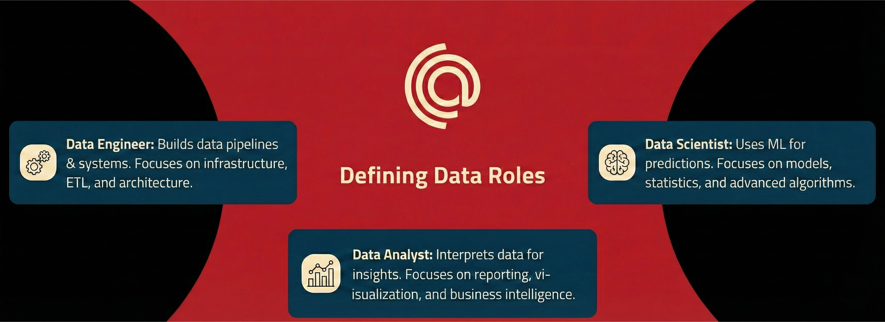
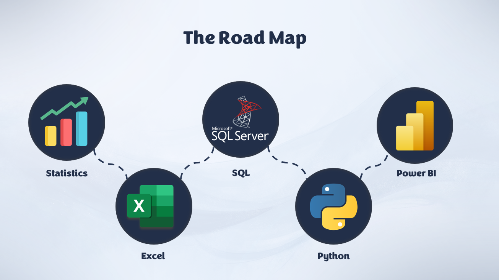

<h1 align="center">Data Analysis Roadmap 2026</h1>

A complete step-by-step roadmap to become a **Data Analyst**, from fundamentals to advanced topics, with tools, skills, and project ideas.

---

## Introduction

Data Analysis is the process of inspecting, cleaning, transforming, and visualizing data with the goal of discovering useful information, informing conclusions, and supporting decision-making.
In a world full of data, a Data Analyst acts as a translator. You take "noise" (messy data) and turn it into a "story" (insights) that a business or organization can use to solve problems.

Remember, remember, remember, Data Analysis is all about the mindset, not tools at all. If you gain this mindset, you can accomplish any task, whatever the tool you use!!

Each tool we will discuss in this roadmap can be used to make a full data analysis project, but each tool is specialized in one or more tasks, so it is a best practice to learn them as much as possible as you can so you use the right tool for the right task.

But before diving into the tools, you should know the life cycle of the data first and the different roles in the field of data.

- Here are the differences between each job title:

- Check also these videos from Data leaders, [Video from Eng. Ahmed Abulkhair](https://www.youtube.com/watch?v=Jbv3InIMsbQ) or this [Video from Eng. Yasser Alaa](https://www.youtube.com/watch?v=PVNsxafgpPo).

---

## Overview

Data Analysis is about:
- Collecting data
- Cleaning & transforming it
- Analyzing patterns
- Visualizing insights
- Communicating results to support decision-making

This roadmap is structured into **phases**, where each phase builds on the previous one.  
All the info about the resources will be in the end of the repo.

---

## Phase 0: Understanding Data Analysis

To gain a solid foundations you must understand:
- Data Literacy
- What exactly Data Analysis is
- What are the tools that you're gonna use

#### Resources
- [Data Literacy course by Maven Analytics](https://mavenanalytics.io/course/data-literacy-foundations)
- [The Data Analysis Process](https://www.youtube.com/watch?v=UNoFXGxk3SI) Arabic video by **Eng. Mohamed Elassal**.
- [What Does a Data Analyst Actually Do?](https://www.youtube.com/watch?v=ywZXpfdqg1o)

---

## Phase 1: Statistics

You **don’t need advanced statistics**, but you must understand:
- Mean, Median, Mode
- Variance & Standard Deviation
- Percentiles & Quartiles
- Probability basics
- Correlation
- Normal distribution
- Sampling & Bias

Goal: Understand what numbers are saying, not just calculate them.

#### Resources (Choose one Course)
- [Introduction to Statistics:](https://app.datacamp.com/learn/courses/introduction-to-statistics) 4-hour course from **DataCamp** (requires subscription).
- [Introduction to Statistics:](https://mavenanalytics.io/course/statistics-for-data-analysis) 13-hour course from **Maven Analytics** (requires subscription)
- [Statistics 1:](https://youtube.com/playlist?list=PL0KQuRyPJoe6KjlUM6iNYgt8d0DwI-IGR&si=4EIuMCWDL-J07u6Q) Simple YouTube playlist from **Simple Learning Pro**.
- [Foundation of Statistical Analysis (Arabic):](https://youtube.com/playlist?list=PLVpJGVBmPnw3eRSzC90oXA6gBcG-nEYIe&si=dGQf1cRDuFW32Q3V) Comprehensive 14-hour Arabic YouTube playlist from **Professor X**.
- [Statistics and Probability 101 (Arabic):](https://youtube.com/playlist?list=PL-cKUB-e2KiuXuUQ9POZoayIOV2oOs5GL&si=2Li9R9PBpuHOoQ8T) 6-hour Arabic YouTube playlist from **ElhosseiniAcademy**.

---

## Phase 2: Excel / Spreadsheets (Core Skill)

Excel is still **heavily used in industry**; if you master it, you will master the rest of the tools.

### 2.1 Essential Skills
- Data types & formatting
- Sorting & filtering
- Conditional formatting
- Text functions (`LEFT`, `RIGHT`, `MID`, `TRIM`)
- Math functions (`SUM`, `AVERAGE`, `COUNT`)
- Logical functions (`IF`, `IFS`, `AND`, `OR`)
- Lookup functions (`VLOOKUP`, `XLOOKUP`, `INDEX + MATCH`)
- Date & time functions

#### Resources (Choose one Course)
- [Excel Essentials (Arabic):](https://youtube.com/playlist?list=PLXlHqMRg9lAYiiutr-Ou0J1uU20T-5a4-&si=8zplj35CZRG6roah) Recommended Arabic YouTube playlist from **Mohamed Alassal** (Watch until the 20th video).
- [Mastering Excel (Arabic):](https://youtube.com/playlist?list=PLof3yw6ZFPFjik6ifGwXs68DLS60OPHYM&si=GOIUaBLSfTUMv-B1) Arabic YouTube playlist from **ALmunthir Saffan**.
- [Excel for Beginners:](https://youtube.com/playlist?list=PLlKpQrBME6xLDnoK7OovAVVsGNV55MS3K&si=V1cE7bMnVYERK9Ip) Youtube playlist from **Kevin Stratvert** (Watch until the 37th video).
- [Excel Foundations:](https://mavenanalytics.io/course/microsoft-excel-foundations) 9-hour course from **Maven Analytics** (requires subscription).
- [Excel Fundamentals:](https://app.datacamp.com/learn/skill-tracks/excel-fundamentals) 16-hour skill track from **DataCamp** (requires subscription).

---

### 2.2 Advanced Excel
- Pivot Tables & Pivot Charts
- Power Query
- Power Pivot & DAX
- Dashboards in Excel

#### Resources (Choose one Course)
- [Data Analysis with Excel (Arabic):](https://youtube.com/playlist?list=PLXlHqMRg9lAbetpJy3ePXsN0sj9Zs-pvT&si=kROdukJApRFlwCX3) Recommended Arabic playlist from **Mohamed Alassal**.
- [Power Query, Power Pivot & DAX:](https://mavenanalytics.io/course/power-query-power-pivot-dax) 12-hour golden course from **Maven Analytics** (requires subscription).
- [Data Analysis with Excel Power Tools:](https://app.datacamp.com/learn/skill-tracks/data-analysis-with-excel-power-tools) 9-hour skill track from **DataCamp** (requires subscription).
- [Excel for Data Analysis:](https://www.youtube.com/watch?v=pCJ15nGFgVg&t=4384s) Comprehensive YouTube video from **Luke Barousse**.

---

## Phase 3: SQL

SQL is **mandatory** for data analysts.

### SQL Basics
- `SELECT`
- `WHERE`
- `ORDER BY`
- `LIMIT`
- `DISTINCT`

---

### Intermediate SQL
- `GROUP BY`
- `HAVING`
- Aggregate functions (`SUM`, `COUNT`, `AVG`)
- `CASE WHEN`
- Joins:
  - `INNER JOIN`
  - `LEFT JOIN`
  - `RIGHT JOIN`
  - `FULL JOIN`

---

### Advanced SQL
- Subqueries
- CTEs (`WITH`)
- Window functions (`ROW_NUMBER`, `RANK`, `LAG`)
- Query optimization basics

#### Resources (Choose one Course)
- [SQL Ultimate Course (Highly Recommended):](https://youtube.com/playlist?list=PLNcg_FV9n7qZY_2eAtUzEUulNjTJREhQe&si=qMWNn-LxtR4F4cAj) If you watched this YouTube playlist, you will be a flying dragon in SQL at the end of the course.
- [SQL Fundamentals:](https://app.datacamp.com/learn/skill-tracks/sql-fundamentals) 26-hour course from **DataCamp** (requires subscription).
- [Transact SQL Queries using SQL Server (Arabic):](https://maharatech.gov.eg/course/view.php?id=2288) A comprehensive, well-known SQL course from **ITI**.
- [MySQL Data Analysis:](https://mavenanalytics.io/course/mysql-data-analysis) 8-hour course from **Maven Analytics** (requires subscription).

---

## Phase 4: Python for Data Analysis

Python is used for deeper analysis, data manipulation, data visualization, and AI.

### Python Basics
- Variables & data types
- Data Structures (Lists, tuples, dictionaries, ...)
- Loops & conditions
- Functions
- File handling

#### Resources (Choose one Course)
- [Mastering Python (Arabic):](https://youtube.com/playlist?list=PLDoPjvoNmBAyE_gei5d18qkfIe-Z8mocs&si=sFTNww_JqV93QraS) YouTube playlist from **Osama Elzero**.
- [Master Python from Scratch (Arabic):](https://youtube.com/playlist?list=PLuXY3ddo_8nzrO74UeZQVZOb5-wIS6krJ&si=Q3SrR9aoDXH4jM8f) YouTube playlist from **Codezilla**.
- [Introduction to Python:](https://www.udacity.com/course/introduction-to-python--ud1110) 14-hours course from **Udacity** (Free).
- [Python Programmer Bootcamp](https://learn.365datascience.com/courses/python-programmer-bootcamp) Complete Python course from **365 Data Science** (requires subscription).

---

### Object-Oriented Programming (OOP)
- Classes & Objects
- Mastering Inheritance, Polymorphism, Encapsulation, and Abstraction.
- Methods & Attributes.
- Constructors (`__init__`).

#### Resources (Choose one Course)
- [Object-Oriented Programming in Python:](https://app.datacamp.com/learn/courses/object-oriented-programming-in-python) 4-hour course by **DataCamp** (requires subscription).
- [Python OOP Mastery (Arabic):](https://youtube.com/playlist?list=PLuXY3ddo_8nzUrgCyaX_WEIJljx_We-c1&si=RI3FIJd0Qod3kTT5) Practical YouTube course by **Codezilla**.
- [Object Oriented Programming with Python:](https://www.youtube.com/watch?v=Ej_02ICOIgs) 2-hour YouTube video by **freeCodeCamp**.

---

### **NumPy** for numerical computing
- Array indexing and slicing
- Vectorization and broadcasting
- Mathematical & statistical functions
- Array reshaping and manipulation

#### Resources (Choose one Course)
- [Learn Numpy in 1 hour:](https://www.youtube.com/watch?v=VXU4LSAQDSc) 1-hour YouTube video by **Bro Code**.
- [Introduction to Numpy:](https://app.datacamp.com/learn/courses/introduction-to-numpy) 4-hour Course from **DataCamp** (You know what I will type here).
- [Numpy | Osama Elzero](https://youtube.com/playlist?list=PLUgz8T_NoatsJCH-DmieQhqhSL2WBvlm-&si=peTE6uOE2XKfGF6T) 1-hour YouTube course from **Osama Elzero**.

---

### **Pandas** for data manipulation
  - DataFrames
  - Filtering & grouping
  - Handling missing values
  - Data transformation
  
#### Resources (Choose one Course)
- [Data Manipulation with Pandas:](https://app.datacamp.com/learn/courses/data-manipulation-with-pandas) 4-hour course from **DataCamp** (requires subscription).
- [Pandas Tutorials](https://youtube.com/playlist?list=PL-osiE80TeTsWmV9i9c58mdDCSskIFdDS&si=JYWivPwbFG1nNZWt) 6-hours YouTube playlist by **Corey Schafer**
- [Data Analysis with Python (Arabic):](https://youtube.com/playlist?list=PLof3yw6ZFPFg5W3Z3sv6GzY6WvvXBqtnD&si=st8BaWwv2hol-Gi5) YouTube playlist from **Almunthir Saffan**
- [Complete Pandas Tutorial:](https://www.youtube.com/watch?v=2uvysYbKdjM) 1.5-hour YouTube video by **Keith Galli**.

---

### **Matplotlib / Seaborn** for visualization
- Line & Scatter Plots
- Bar & Pie Charts
- Histograms & Box Plots
- Heatmaps & Correlation
- Chart Customization

#### Resources (Choose one Course)
- [Introduction to Data Visualization with Matplotlib:](https://app.datacamp.com/learn/courses/introduction-to-data-visualization-with-matplotlib) 4-hour course from **DataCamp** (requires subscription).
- [Matplotlib Tutorials](https://youtube.com/playlist?list=PL-osiE80TeTvipOqomVEeZ1HRrcEvtZB_&si=sCfulKEUT5IOYykP) 4-hours YouTube playlist by **Corey Schafer**.
- [Introduction to Data Visualization with Seaborn:](https://app.datacamp.com/learn/courses/introduction-to-data-visualization-with-seaborn) 4-hour course from **DataCamp** (requires subscription).
- [Seaborn Beginner to Pro:](https://youtube.com/playlist?list=PL4GjoPPG4VqOAwSNw2I-PXUcjw1frHmW2&si=idYsDKPmanYKO186) 4-hour YouTube playlist by **Learnerea**.

---

## Phase 5: Data Visualization & BI Tools

Visualization turns analysis into **insight**.

### Visualization Principles
- Choosing the right chart
- Avoiding misleading visuals
- Color theory
- Storytelling with data

---

### BI Tools
Choose **at least one**:
- **Power BI**
- **Tableau**
- **Looker Studio**

Skills to master:
- Data modeling
- Relationships
- Measures & calculations
- Interactive dashboards
- Filters & slicers

---

## Phase 6: Business & Domain Knowledge

A great analyst understands **context**, not just data.

### Business Skills
- KPIs & metrics
- Stakeholder communication
- Translating insights into actions
- Writing clear reports

### Domains (pick one and master it)
- Marketing analytics
- Finance analytics
- Healthcare analytics
- Education analytics
- Product analytics

---

## Phase 7: Git, GitHub

### Git Basics
- Repositories
- Commits
- Branches
- README files

---

## The resources in this roadmap

### High-Impact Free Resources (YouTube)
YouTube is a perfect resource for any Data Analyst. We highly recommend following these industry leaders:

[Mohamed Alassal:](https://www.youtube.com/@mohamedalassaal) The father of Arabic learners, focusing on Data & Financial Analysis.

[Almunthir Saffan:](https://www.youtube.com/@ALMunthirSaffan) Delivers concise Arabic tutorials for mastering Power BI, Excel VBA, and Power Query through structured lessons.

[Baraa Khatib:](https://www.youtube.com/@DataWithBaraa) An ex-Mercedes-Benz Data Engineer who uses visual storytelling to simplify complex topics.

[Alex the Analyst:](https://www.youtube.com/@AlexTheAnalyst) His content ranges from technical tool training to actual portfolio-building projects and job search tips.

[Maven Analytics:](https://www.youtube.com/@MavenAnalytics) The official channel of the popular learning platform. They focus on teaching the "business side" of data.

[Kevin Stratvert](https://www.youtube.com/@KevinStratvert) An ex-Microsoft Product Manager. Covers general tech, tutorials on Excel, AI tools, and Microsoft 365.

### Premium Learning Platforms

When you're ready for a more structured curriculum with certifications, these platforms are the best choice for you:

[Maven Analytics (Top Choice):](https://app.mavenanalytics.io/) Widely considered the best platform for Data Analysts.  
Tip: While it is a paid service, they are known for the free access weeks, so keep an eye out to watch their high-quality content for free.

[DataCamp:](https://app.datacamp.com/) Known for its interactive "learn-by-doing" coding environment.  
Tip: DataCamp is very generous with scholarships, making it fully accessible if you apply for one.

[Coursera:](https://www.coursera.org/) The best platform for big organization courses like GOOGLE, IBM, Stanford University, etc.  
Tip: You can apply for financial aid from a mobile to get the course 100% free or from a PC and get 90% discount.

[365 Data Science:](https://365datascience.com/) A great all-in-one solution if you want a guided path from math and statistics all the way to machine learning.
Tip: It is paid like the others, but you can wait for the free access weeks like the rest of the platforms.

---

Made by [Abdelrahmen Elashry](https://github.com/Abdelrahmen-Elashry)
